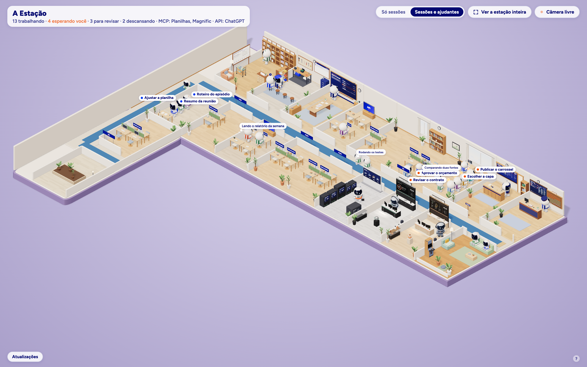

# A Estação

**Veja os seus agentes de IA trabalhando.** A Estação mostra as sessões do Claude Code e do Codex que estão abertas no seu Mac como pequenos astronautas numa estação 3D vista de cima, como uma maquete. Cada astronauta é uma conversa de verdade: quando ela edita arquivos, ele trabalha na mesa; quando pesquisa na internet, vai para a sala de pesquisa; quando espera você responder, entra na fila da sua mesa; quando termina, descansa e depois vai embora.

Tudo roda só no seu computador. Nada sobre as suas conversas é enviado para a internet.



## O que aparece na tela

- **Um astronauta por sessão.** Cada conversa aberta do Claude Code ou do Codex vira um astronauta, com uma cor própria na mochila. Os olhos e a antena mostram o provedor: coral para o Claude, verde para o Codex.
- **Os ajudantes também aparecem.** Cada tarefa que a sessão põe para rodar em segundo plano (um subagente, um workflow, um comando longo) vira um astronauta sentado junto dela, com a mesma cor. Um workflow inteiro é um astronauta só, com o nome da tarefa. Um seletor no canto alterna entre **"Só sessões"** e **"Sessões e ajudantes"**.
- **Uma sala por pasta, um conjunto de mesas por sessão.** Cada pasta de projeto em uso ganha uma sala com a placa do nome dela na entrada. Dentro, cada sessão ganha o seu conjunto de mesas, com a plaquinha do nome da conversa. Os conjuntos aparecem e somem com a demanda.
- **A estação cresce e encolhe sozinha.** Ela começa pequena e acopla salas conforme a necessidade. Com poucos astronautas o corredor é reto; com muitos (a partir de uns 50), ele dobra e volta em paralelo, formando um U que cabe na tela. O espaço que sobra vira descompressão: jardim, sala de ioga, fliperama ou parquinho.
- **Salas por atividade.**
  - **Pesquisa:** busca na internet e uso do navegador.
  - **MCP e API:** uso de conectores e de serviços pelo terminal. O monitor mostra o nome do serviço em uso.
  - **Descanso:** sofá, fliperama, videogame, ioga e meditação. Quem terminou descansa ali e depois sai pela porta.
  - **Missão:** um quadro com as etapas dos workflows que estão rodando.
  - **Oficina:** quem travou (comando que passou do tempo, conector que não responde) espera atendimento.
  - **Biblioteca da memória:** as memórias e skills que as sessões estão consultando.
  - **Servidores:** um rack para cada servidor local que você subiu, do tamanho do consumo dele, mais um painel com CPU, placa de vídeo, memória e disco da máquina.
  - **Portaria:** os conectores ligados e os que pedem login.
  - **Despacho:** as rotinas agendadas.
  - **Salas Anthropic e OpenAI:** medidores de uso do plano (janela de 5 horas e de 7 dias), com operadores que cuidam dos painéis.
- **Fila na sua mesa.** Quem precisa de você (uma pergunta ou um pedido de aprovação) faz fila na frente da sua mesa. Quem terminou com uma sugestão para você revisar faz fila na sala de revisão. Clicar na notinha de quem está na fila abre aquela conversa no app certo.
- **Relógio e descanso.** Quando uma sessão para, aparece um reloginho em cima do astronauta. Depois de 60 segundos ele vai descansar; depois de mais 3 minutos sai da estação. Se a sessão voltar a trabalhar, ele volta para o lugar.
- **Balão de pensamento e detalhes.** Cada ação nova aparece por uns 2 segundos num balãozinho. Ao passar o mouse num astronauta você vê o nome da conversa, o que ela está fazendo e quanto da janela de contexto já foi usado.
- **Exibição dinâmica.** A câmera se ajusta sozinha para mostrar todos os astronautas na mesma tela, com zoom e centro suaves. Arrastar ou dar zoom com a mão pausa o ajuste, que volta sozinho depois de 1 minuto sem mexer. O botão **"Ver a estação inteira"** afasta a câmera até caber tudo.
- **Atualizações.** O botão no canto de baixo mostra a versão que você tem, tem um "Verificar agora" e, quando houver versão nova, o passo a passo para atualizar.

## Requisitos

- **macOS** (o app de dois cliques e a leitura das sessões foram feitos e testados no Mac).
- **Node.js 20 ou mais novo** ([nodejs.org](https://nodejs.org)). Para conferir: `node -v`.
- **Claude Code e/ou Codex** instalados e já usados nesta conta do Mac (no terminal ou nos apps de desktop). Sem nenhum dos dois, A Estação abre, mas fica vazia.
- Um navegador atual (Chrome, Safari, Edge, Firefox ou Arc).

## Como instalar

No Terminal:

```bash
git clone https://github.com/astronauta-martech/a-estacao.git
cd a-estacao
npm install
./instalar.sh
```

- `npm install` baixa as dependências: o [Three.js](https://threejs.org) (o motor 3D) e a fonte [Figtree](https://fonts.google.com/specimen/Figtree), que passa a ser servida pela própria Estação.
- `./instalar.sh` confere os requisitos, cria o app **"A Estação"** de dois cliques dentro da pasta do projeto, com o ícone do astronauta, e um atalho na sua Mesa. Se preferir sem atalho: `./instalar.sh --sem-atalho`.

O app guarda o caminho da pasta onde você clonou. Se mudar a pasta de lugar, rode `./instalar.sh` de novo.

## Como abrir

**Jeito fácil:** dois cliques em **"A Estação"** (na Mesa ou na pasta do projeto). Ele liga o servidor local, se ainda não estiver ligado, e abre a página no navegador.

**Pelo Terminal:** `npm start` e abra [http://localhost:4317](http://localhost:4317).

**Para desligar:** `./parar.sh` (ou `npm run parar`). Fechar a aba do navegador não desliga o servidor.

### Opções

| Variável ou endereço | Para que serve |
| --- | --- |
| `PORTA=4400 npm start` | Usa outra porta (a padrão é 4317). O app de dois cliques usa sempre a 4317. |
| `CLAUDE_CONFIG_DIR`, `CODEX_HOME` | Se o seu Claude Code ou Codex grava em outra pasta, A Estação lê de lá. |
| `PAINEL_USO_URL` | Endereço local de onde vêm os limites do plano Claude (veja Limitações). `PAINEL_USO_URL=nao` desliga. |
| `ESTACAO_NOVIDADES=nao npm start` | Não consulta as atualizações no GitHub (aí nada sai da máquina). |
| `?simular=0`, `1`, `4` ou `10` | Modo de ensaio, com astronautas de mentira. Bom para tirar prints sem mostrar as suas conversas. `&x=5` acelera o tempo. |
| `?simular=0&extra=100` | Ensaio de carga com 100 astronautas. `&carga=50-120&min=10` varia de 50 a 120 ao longo de 10 minutos. |

## Atualização

A Estação sabe a própria versão (o número em `app/package.json` e, num clone do git, o commit). Para saber se há versão nova, o servidor pergunta ao GitHub qual é a última *release* deste repositório, no máximo uma vez a cada 6 horas ou quando você clica em **"Verificar agora"**. Sem internet, o botão fica neutro e nada quebra.

**A página não atualiza nada sozinha.** Para atualizar:

1. Feche A Estação: `./parar.sh`.
2. Na pasta do projeto, rode `./atualizar.sh`. Ele confere se você mudou algum arquivo do projeto (se mudou, mostra quais e para, sem sobrescrever nada), baixa a versão nova com `git pull --ff-only` e atualiza as dependências.
3. Abra de novo: dois cliques no app ou `./iniciar.sh`.

Quem mantém o repositório: publique cada versão como uma *release* do GitHub, com etiqueta no formato `v0.8.0` e as notas em português, e suba o `version` de `app/package.json` junto.

## Privacidade

A Estação foi feita para só olhar, nunca mexer.

- **Só leitura, só local.** Ela lê os registros que o Claude Code e o Codex já gravam na sua máquina: `~/.claude` (sessões abertas e transcrições), `~/.codex/sessions` e, no caso do app de desktop do Claude, a lista de nomes dos conectores em `~/Library/Application Support/Claude`. Não lê senhas, chaves nem credenciais de login, e esconde nos balões o que parece segredo.
- **Da sua conta, só o nome.** Para a plaquinha da sua mesa, ela pega apenas o nome de exibição da conta local.
- **Nada sai da máquina.** Não há envio de dados, telemetria nem conta para criar. O servidor escuta só em `127.0.0.1` e recusa pedidos que não venham da própria página. A fonte vem junto com o projeto.
- **A única chamada externa é opcional: as atualizações.** A pergunta ao GitHub não leva nenhum dado seu. Para desligar: `ESTACAO_NOVIDADES=nao`.
- **Não muda nada no Claude nem no Codex.** Não altera configurações, não instala ganchos, não atrasa nenhuma sessão.
- **Uma única ação possível:** clicar na notinha de quem está na fila abre aquela conversa no app certo. O endereço é montado pelo próprio servidor, nunca vem da página. A Estação não envia mensagens, não aprova nada e não dá ordens aos agentes.

Os prints da tela mostram os nomes e os pensamentos das suas conversas. Para compartilhar, use o modo de ensaio (`?simular=10`).

## Desempenho

Testado num MacBook Pro com 100 astronautas na tela ao mesmo tempo: 55 quadros por segundo, uns 2 núcleos de processador para o navegador e menos de 100 MB de memória para a página. Com tudo parado a página quase não desenha, e com a aba escondida não gasta nada. O servidor usa menos de 1% de CPU.

## Limitações

- **Só macOS** por enquanto. O servidor é Node puro, mas o app de dois cliques, a leitura das sessões do app de desktop e o botão de abrir a conversa dependem do Mac.
- **Limites do plano Claude dependem de uma fonte local opcional.** O Claude Code não grava a porcentagem de uso do plano nos arquivos locais. A Estação lê esses números do painel [AI Usage](https://github.com/astronauta-martech/ai-usage), se ele estiver rodando no mesmo Mac (`http://127.0.0.1:8090`). Sem ele, a Sala Anthropic mostra "indisponível". Os limites do Codex vêm das próprias sessões do Codex.
- **"Terminou com sugestão" é um palpite.** Perguntas pendentes e pedidos de aprovação são detectados com segurança. Já a ideia de que uma conversa "terminou oferecendo um próximo passo" vem do jeito que a última mensagem termina e pode errar.
- **Depende do formato dos registros.** A Estação lê arquivos internos do Claude Code e do Codex, que podem mudar a cada versão.
- **Nomes de serviços, não logos.** As telas mostram o nome escrito do serviço em uso; não há logos de terceiros.

## Problemas comuns

- **Dois cliques não faz nada ou mostra um aviso:** rode `./instalar.sh` de novo (acontece quando a pasta muda de lugar ou o Node é reinstalado). O registro do servidor fica em `logs/servidor.log`.
- **"Porta em uso":** outro programa está na 4317. Desligue com `./parar.sh` ou use `PORTA=4400 npm start`.
- **A estação está vazia:** abra uma sessão do Claude Code ou do Codex e mande uma mensagem. Para ver como fica cheia, use `?simular=10`.
- **Node instalado com nvm, Volta ou asdf:** rode o `./instalar.sh` no mesmo Terminal em que `node -v` funciona; ele guarda o caminho certo do Node para o app.

## Créditos

- Criado pela **Astronauta Martech**.
- Motor 3D: [Three.js](https://threejs.org), licença MIT, baixado pelo `npm install` (não faz parte deste repositório).
- Fonte: [Figtree](https://fonts.google.com/specimen/Figtree), licença SIL Open Font License, servida localmente pelo pacote [@fontsource/figtree](https://fontsource.org/fonts/figtree).
- Claude e Anthropic são marcas da Anthropic. Codex, ChatGPT e OpenAI são marcas da OpenAI. Os nomes de serviços e conectores exibidos pertencem aos seus titulares. Este projeto não tem afiliação com nenhuma dessas empresas.

## Licença

**Licença de Uso Astronauta Martech, versão 1.0.** Em resumo: você pode usar, copiar, adaptar e compartilhar de graça, inclusive para prestar serviços pagos; não pode cobrar pela Estação em si; precisa manter o aviso de licença e o crédito à Astronauta Martech; e o material vem sem garantia. O texto completo, em português e em inglês, está em [LICENSE](LICENSE).
